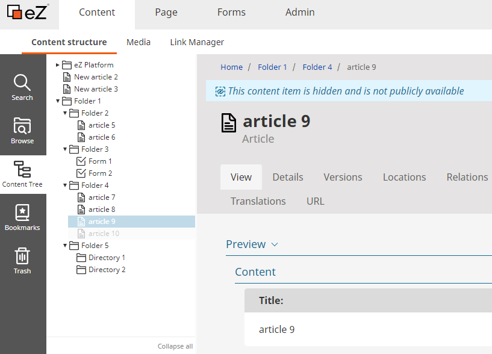
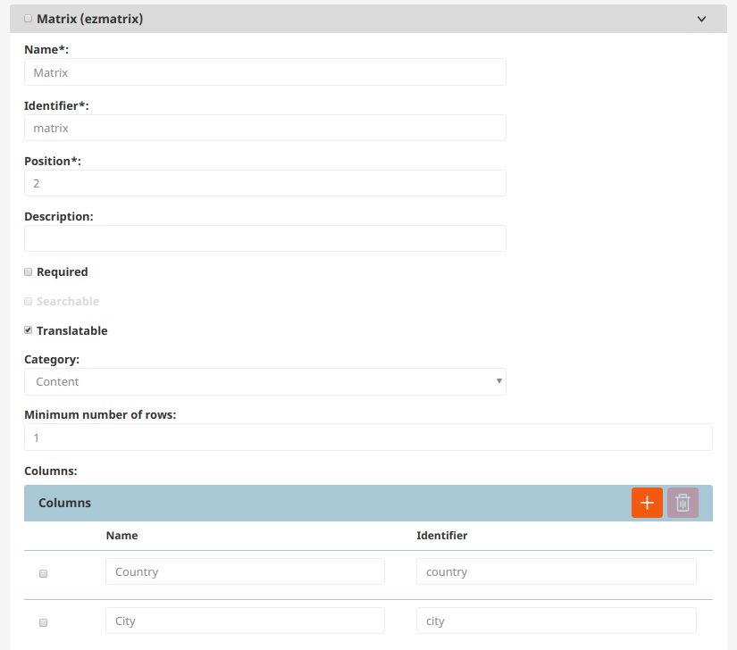
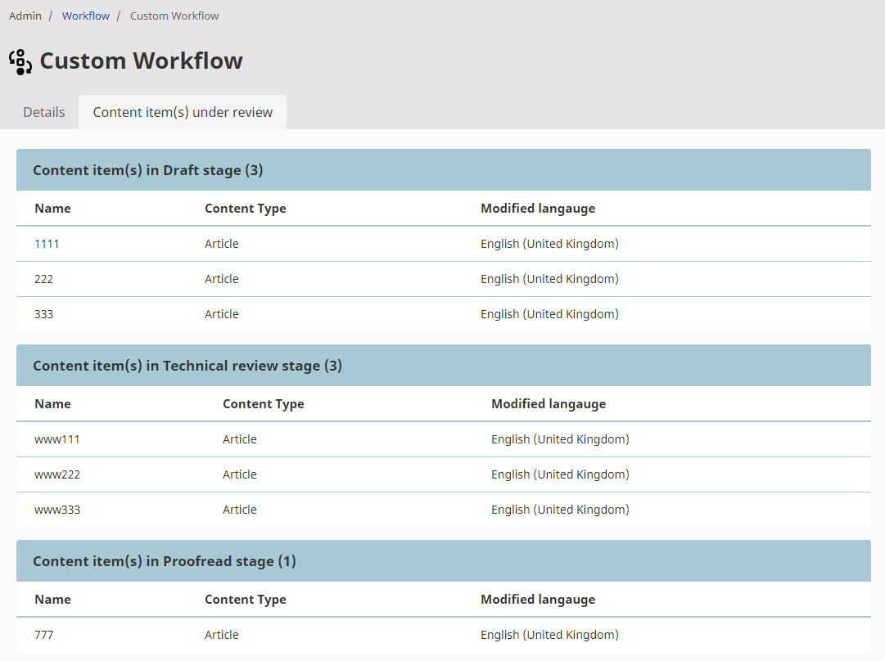
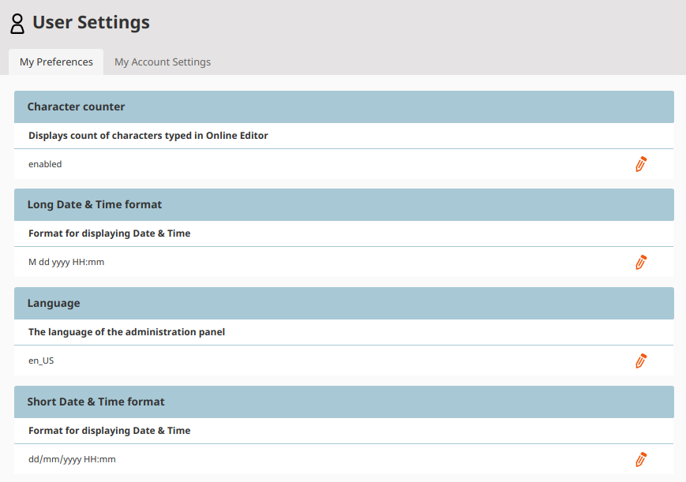
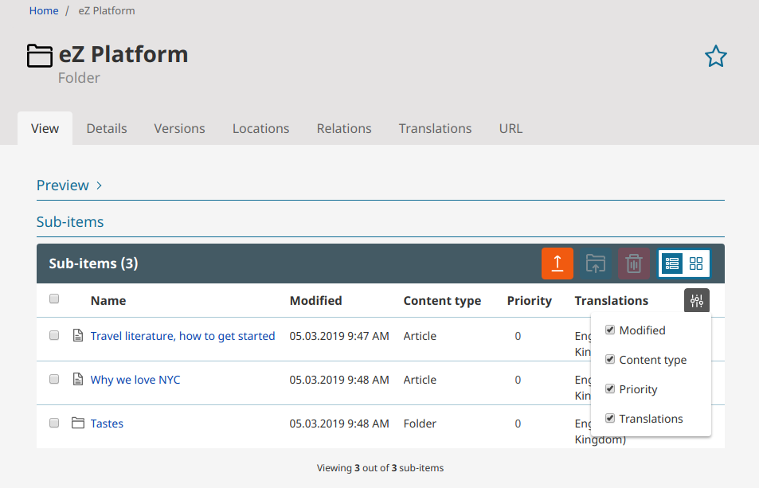

# eZ Platform v2.5

**Version number**: v2.5

**Release date**: March 29, 2019

**Release type**: Long Term Supported

## Notable changes

### Content Tree

You can now navigate through your website with a Content Tree.
It will allow you to easily browse your content in the Back Office.
Each Content item has a unique icon that helps you identify it without opening.



For more information on custom configuration, see [Content Tree](../guide/config_back_office/#content-tree) in the developer documentation.

For full description of the interface, see [Content Tree](https://doc.ezplatform.com/projects/userguide/en/latest/content_model/#content-tree) in the user documentation.

### Webpack Encore

This release introduces [Webpack Encore](https://symfony.com/doc/2.8/frontend.html#webpack-encore)
as the preferred tool for asset management.
This leads to [changes in requirements](#requirements-changes).

Assetic is still in use, but it will be deprecated in a future version.

### PostgreSQL

This release enables you to [use PostgreSQL](../guide/databases.md#using-postgresql) for database instead of the default MySQL.

Database schema is now created based on [YAML configuration](https://github.com/ezsystems/ezpublish-kernel/blob/v7.5.3/eZ/Bundle/EzPublishCoreBundle/Resources/config/storage/legacy/schema.yaml).

### GraphQL

You can now take advantage of [GraphQL](../api/graphql.md) to query and operate on content.
It uses a domain schema based on your content model.

See [GraphQL documentation](https://graphql.org/) for more information about GraphQL in general.

### Matrix Field Type

The new [Matrix Field Type](../api/field_type_reference.md#matrix-field-type) enables you to store a table of data.
Columns in the matrix are defined in the Field definition.



#### Migration of legacy XML format

You can now migrate your content from legacy XML format to a new `ezmatrix` value with the following command:

```bash
bin/console ezplatform:migrate:legacy_matrix
```

### User bundle

The new [ezplatform-user](https://github.com/ezsystems/ezplatform-user) bundle now centralizes
all features related to user management, such as user accounts, registering, changing passwords, etc.

!!! enterprise

    ### Workflow improvements

    You can now preview a diagram of the configured workflows in the Admin Panel.

    

    After selecting configured workflow administrator, the user is now able to see all Content items under review for it.

    

### Online editor improvements

#### Anchors in Rich Text Field

You can now link fragments of text by adding Anchors in Rich Text Fields.

#### Inline custom tags

You can now create [inline custom tags](../guide/extending_online_editor.md#inline-custom-tags) in Rich Text Fields.

#### Custom CK Editor plugins

You can now easily use [custom CK Editor plugins](../guide/extending_online_editor.md#plugins-configuration) in AlloyEditor.

### Hiding and revealing content

You can now hide and reveal Content items from the Back Office.
Hidden content will be unavailable on the front page regardless of permissions or [Location visibility](../guide/content_management.md#location-visibility).


### Product version preview

The Dashboard now shows the version of eZ Platform you are running.


### Expanded User Settings

The User Settings menu has been expanded with the following options:

- Preferred language of the Back Office
- Preferred date format
- Option to enable or disable a character counter for Rich Text Fields



### Various Back Office improvements

This release introduced several Back Office improvements to facilitate editorial experience, including:

- [Icons for Content Types and the ability to define them](../guide/extending_ez_platform.md#custom-content-type-icons)
- Ability to collapse and expand content preview to have easier access to the Sub-items list
- Responsive Sub-items table with selectable column layout
- Simpler assigning of Object States to content




### Permissions

#### Content/Create policy for Users

You can now define a 'Content/Create' policy for a User or a User group.
It will enable or disable (if not set) the **Create** button in your dashboard.

#### Universal Discovery Widget

`allowed_content_types` can now limit selection in UDW search and browse sections to specified Content Types.


### API improvements

New API improvements include:

- `sudo()` exposed officially in API to make it more clear how you can skip permission checks when needed
- `AssignSectionToSubtreeSignal` to assign Sections to subtrees
- new `loadLanguageListByCode()` and `loadLanguageListById()` endpoints for bulk loading of languages
- new method `ContentService->loadContentInfoList()` for bulk loading Content information
    - it can be used with `ContentService->loadContentListByContentInfo()` to bulk load Content
    - v2.5 also takes advantage of it in e.g. `RelationList` and `ParameterProvider`
- now Persistence cache layer also caches selected metadata objects in-memory
- indexation of related objects in the full text search

## Requirements changes

Due to using Webpack Encore, you now need [Node.js and yarn](../updating/3_update_app.md)
to install or update eZ Platform.

This release also changes support for versions of the following third-party software:

- Solr 4 is no longer supported. Use Solr 6 instead (Solr 6.6LTS recommended).
- Apache 2.2 is no longer supported. Use Apache 2.4 instead.
- Varnish 4 is no longer supported. Use Varnish 5.1 or higher (6.0LTS recommended).

For full list of supported versions, see [Requirements](../getting_started/requirements.md).

### Password requirements

This version introduces stricter default password quality requirements.

Passwords must be at least 10 characters long, and must include upper and lower case letters, and digits.
Existing passwords are not changed.

See [backwards compatibility changes](https://github.com/ezsystems/ezpublish-kernel/blob/v7.5.3/doc/bc/changes-7.5.md)
for detailed information.

## Full changelog

| eZ Platform  | eZ Enterprise  |
|--------------|------------|
| [eZ Platform v2.5.0](https://github.com/ezsystems/ezplatform/releases/tag/v2.5.0) | [eZ Enterprise v2.5.0](https://github.com/ezsystems/ezplatform-ee/releases/tag/v2.5.0) |
| [eZ Platform v2.5.0-rc2](https://github.com/ezsystems/ezplatform/releases/tag/v2.5.0-rc2) | [eZ Enterprise v2.5.0-rc2](https://github.com/ezsystems/ezplatform-ee/releases/tag/v2.5.0-rc2) |
| [eZ Platform v2.5.0-rc1](https://github.com/ezsystems/ezplatform/releases/tag/v2.5.0-rc1) | [eZ Enterprise v2.5.0-rc1](https://github.com/ezsystems/ezplatform-ee/releases/tag/v2.5.0-rc1) |
| [eZ Platform v2.5.0-beta2](https://github.com/ezsystems/ezplatform/releases/tag/v2.5.0-beta2) | [eZ Enterprise v2.5.0-beta2](https://github.com/ezsystems/ezplatform-ee/releases/tag/v2.5.0-beta2) |
| [eZ Platform v2.5.0-beta1](https://github.com/ezsystems/ezplatform/releases/tag/v2.5.0-beta1) | [eZ Enterprise v2.5.0-beta1](https://github.com/ezsystems/ezplatform-ee/releases/tag/v2.5.0-beta1) |

## eZ Platform v2.5.2

### Updating

The `leafo/scssphp` package had to be replaced by `scssphp/scssphp` due to maintainability.
If you use classes from the `Leafo\ScssPhp` namespace, change them to `ScssPhp\ScssPhp`.

### SolrCloud

You can now take advantage of [SolrCloud in eZ Platform Solr search engine](../guide/solr.md#solrcloud).
It enables you to set up a cluster of Solr servers for highly available and fault tolerant environment.

### Online Editor

#### Custom attributes

It is now possible to add [custom data attributes and CSS classes](../guide/extending_online_editor.md#custom-data-attributes-and-classes) to elements in the Online Editor.

#### Translatable custom tag choice attributes

You can now translate labels of choice attributes in Custom tags using the `ezrichtext.custom_tags.<tag_name>.attributes.<attribute>.choices.<choice>.label` configuration key.

### URL Wildcards

[URL wildcards](../guide/url_management.md#url-wildcards) enable you to set up global URL redirections.

## eZ Platform v2.5.3

### API improvements

`SectionService::loadSection` has been improved to return a filtered list when user does not have access to a Section,
instead of throwing an exception.

## eZ Platform v2.5.4

### Permission improvements

`RoleService` methods have been improved to return a filtered list when user does not have access to content,
instead of throwing an exception. The following methods are affected:

- `RoleService::loadRoles`
- `RoleService::getRoleAssignmentsForUser`
- `RoleService::getRoleAssignmentsForUserGroup`

`content/cleantrash` Policy now allows the user to empty the trash
even if they would not have access to the trashed content.

### Docker environment

BCMath PHP extension has been added to the Docker environments
in order to enable the Allure reporting tool.

### Deprecated features

This section provides a list of deprecated features to be removed in eZ Platform v3.0.

#### Custom Installers

- The `\EzSystems\PlatformInstallerBundle\Installer\CleanInstaller` class and its Service Container definition (`ezplatform.installer.clean_installer`) have been deprecated in favor of `EzSystems\PlatformInstallerBundle\Installer\CoreInstaller` which requires the [Doctrine Schema Bundle](https://github.com/ezsystems/doctrine-dbal-schema) to be enabled.
- The `ezplatform.installer.db_based_installer` Service Container definition has been deprecated in favor of its FQCN-named equivalent (`EzSystems\PlatformInstallerBundle\Installer\DbBasedInstaller`).

## eZ Platform v2.5.6

### Configuration through `ezplatform`

In YAML configuration, you can now use `ezplatform` as well as `ezpublish` as the main configuration key.

### API improvements

The following PHP API methods have been added:

- `ContentService::countContentDrafts` returns the number of all drafts for the provided user
- `ContentService::loadContentDraftList` returns a list of all drafts for the provided user
- `ContentService::countReverseRelations` returns the number of all reverse relations for a Content item
- `ContentService::loadReverseRelationList` returns a list of all reverse relations for a Content item

### Solr 7.7

With v2.5.6 you can optionally use Solr 7.7. To enable it:

1. Update the `ezplatform-solr-search-engine` package version to ~2.0.
2. Follow [Solr upgrade documentation](https://lucene.apache.org/solr/guide/7_7/solr-upgrade-notes.html).
3. Reindex your content.
4. Clear cache.

## eZ Platform v2.5.9

### Search result improvements

When searching in the Back Office you can now select languages to filter results through.

### Searchable Matrix Field

The Matrix Field is not fully searchable.
