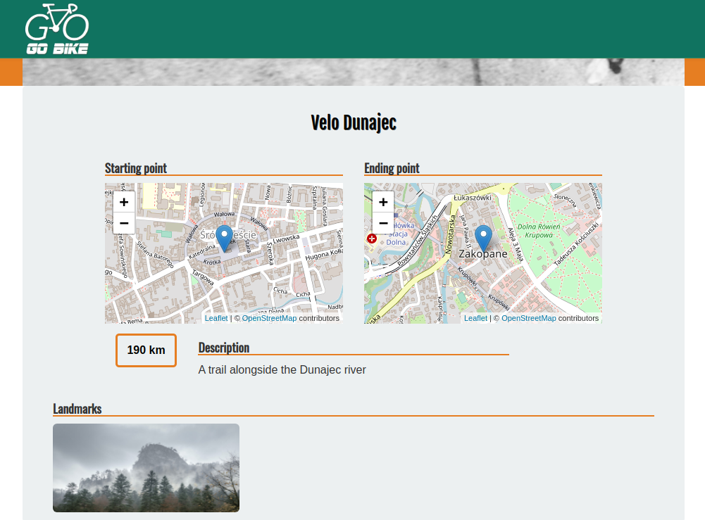

# Step 6 - Embed content

## Create the Landmark Content Type

Now you need to create the second Content Type needed in the site, **Landmark**.

Go to Admin Panel &gt; Content types, and under the **Content** group, create the Landmark Content Type.

A Landmark is an interesting place that Rides go through. Each Ride may be related to multiple Landmarks.

- **Name**: Landmark
- **Identifier**: landmark

Then create all Fields with the following information: 

| Field Type   | Name             | Identifier       |  Required | Searchable | Translatable |
| ------------ | ---------------- | ---------------- | --------- | ---------- | ------------ |
| Text line    | Name             | `name`           | yes       | yes        | yes          |
| Rich Text    | Description      | `description`    | no        | yes        | yes          |
| Image        | Photo            | `photo`          | yes       | no         | no           |
| Map location | Location         | `location`       | yes       | yes        | no           |

Confirm the creation of the Content Type by selecting OK.

Create a "Landmarks" Folder add some Landmarks to it.
Note that you will need pictures (for the Photo Field) to represent them.

## Add Landmarks to Ride Content Type definition

Now edit the Ride Content Type in order to add a Multiple Content Relation between the two Content Types.
Create a new Field called "Landmarks" with identifier `landmarks` and allow Content Type "Landmark" to be added to it:

")

Go back to one of your existing Rides, edit it and link some Landmarks to it.

## Display a list of Landmarks in Ride view

### Create Landmark line view

Now you need to create the line view for Landmarks.

Declare a new override rule in `app/config/views.yml`:

``` yaml
ezpublish:
    system:
        site_group:
            content_view:
                #full views here
                line:
                    landmark:
                        template: 'line/landmark.html.twig'
                        match:
                            Identifier\ContentType: 'landmark'
```

Create the template for the line view of a Landmark: `app/Resources/views/line/landmark.html.twig`:

``` html+twig hl_lines="4"
<section>
<div class="col-xs-4 photos-box">
    <a href="#bikeModal{{ content.id }}" data-toggle="modal">
        {{ ez_render_field( content, 'photo', { parameters: { 'alias': 'landmark_list', 'class': 'img-responsive img-rounded'}}) }}
    </a>
</div>

{# MODAL #}
<div class="bike-modal modal fade" id="bikeModal{{ content.id }}" tabindex="-1" role="dialog" aria-hidden="true">
    <div class="modal-content">
        <div class="close-modal" data-dismiss="modal">
            <div class="lr">
                <div class="rl">
                </div>
            </div>
        </div>
        <div class="container">
            <div class="row">
                <div class="col-xs-8 col-xs-offset-2">
                    <div class="modal-body text-center">
                        <h2>{{ content.name }}</h2>
                        <hr class="featurette-divider">
                        {{ ez_render_field( content, 'photo', { parameters: { 'alias': 'large'}, attr: { 'class': 'img-responsive img-rounded' }}) }}
                        {{ ez_render_field( content, 'description', { attr: { 'class': 'padding-box text-justify' }}) }}
                        {{ ez_render_field( content, 'location', { parameters: {'width': '100%', 'height': '250px', 'showMap': true, 'showInfo': false }}) }}
                    </div>
                </div>
            </div>
        </div>
    </div>
</div>
</section>
```

Like before, you use an image variation here (line 4) and you need to configure it.
Add the following section to `app/config/image_variations.yml`, at the same level as `ride_list`:

``` yaml
landmark_list:
    reference: null
    filters:
        - {name: geometry/scalewidth, params: [200]}
```

### Create the RideController

In the AppBundle directory, create a new file: `src/AppBundle/Controller/RideController.php`

``` php
<?php

namespace AppBundle\Controller;

use eZ\Bundle\EzPublishCoreBundle\Controller;
use eZ\Publish\Core\MVC\Symfony\View\ContentView;

class RideController extends Controller
{
    /**
     * Action used to display a ride
     *    - Adds the list of all related Landmarks to the response.
     *
     * @param ContentView $view
     *
     * @return ContentView $view
     */
    public function viewRideWithLandmarksAction(ContentView $view)
    {
        $repository = $this->getRepository();
        $contentService = $repository->getContentService();
        $currentContent = $view->getContent();
        $landmarksListId = $currentContent->getFieldValue('landmarks');
        $landmarksList = [];

        foreach ($landmarksListId->destinationContentIds as $landmarkId) {
            $landmarksList[$landmarkId] = $contentService->loadContent($landmarkId);
        }

        $view->addParameters(['landmarksList' => $landmarksList]);

        return $view;
    }
}
```

Update `app/config/views.yml` to mention the RideController by adding a line with the `controller` key to the view config.

``` yaml hl_lines="7"
ezpublish:
    system:
        site_group:
            content_view:
                full:
                    ride:
                        template: 'full/ride.html.twig'
                        controller: 'AppBundle:Ride:viewRideWithLandmarks'
                        match:
                            Identifier\ContentType: 'ride'
```

### Add the Landmark in the Ride full view

Now modify the Ride full view template to include a list of Landmarks.
Add the following lines at the end of `app/Resources/views/full/ride.html.twig`, before the last `</div>` and the closing tag ``:

``` html+twig

    <div class="row regular-content-size">
        <section class="photos">
            <div class="col-xs-12">
                <h4 class="underscore">{{ 'Landmarks'|trans }}</h4>
            </div>
            
                {{ render( controller( "ez_content:viewAction", { 'content': landmark, 'viewType': 'line'} )) }}
            
        </section>
    </div>

```

You can now check the Ride page again to see all the connected Landmarks.


